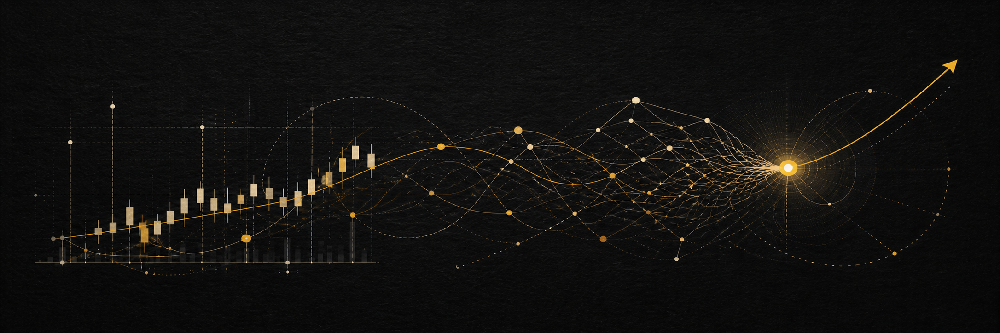

  

  <h1>你好，我是武芊秀 👋</h1>

  
<strong>Finance Student · AI Explorer · Creative Project Builder</strong>

  
把金融思维、人工智能工具与创意项目执行连接起来。

  

    
    
    
  

## 关于我 / About Me

> 我喜欢把模糊的想法整理成清晰的路径，再通过调研、协作与迭代，让它真正成为可以展示、验证和继续生长的作品。

- 🎓 西安理工大学金融学本科在读，专业排名 **1 / 49**
- 🤖 持续探索提示词工程、智能体、模型微调与 AI 辅助内容创作
- 🧭 擅长目标拆解、市场调研、项目统筹与跨专业协作
- 🎨 关注信息逻辑与视觉表达，使用 Figma、Obsidian 等工具沉淀作品与知识
- 🌱 目前正在推进设计竞赛与个人作品集建设

## 代表项目 / Featured Work

### 01 · [个人作品集网站](https://github.com/Gugu-xiu/guww0q0xxgu)

记录我的学习成长、项目作品、能力认证与校园实践。项目采用清晰的档案式结构，希望让每一项经历都能看到背景、行动、结果与证据。

`Portfolio` `Project Archive` `HTML` `Visual Storytelling`

### 02 · [绮梦序章 · 白翎之约系列盲盒](https://www.figma.com/design/f2GxNSqkGbVnG6wt9bJzv8/%E6%96%87%E5%88%9B%E4%BA%A7%E5%93%81-%E7%9B%B2%E7%9B%92?node-id=0-1&t=EkWRzaFXCXX0Up5u-0)

担任三人跨专业团队负责人，负责市场调研、项目统筹与 AI 视觉方向；累计生成、筛选 **200 余张**视觉草案，完成 **12 轮以上**内部迭代，获中国好创意暨全国数字艺术设计大赛**省级三等奖**。

`Project Lead` `Market Research` `AI Visuals` `Figma`

## 能力组合 / Skills

| 思考与研究 | AI 实践 | 执行与表达 |
| --- | --- | --- |
| 市场调研 · 用户访谈 · 竞品分析 | 提示词工程 · 基础智能体 · 模型微调认知 | 项目策划 · 跨专业协作 · 内容与视觉表达 |

  
  
  
  
  
  
  

## 认证与实践 / Credentials

- 科大讯飞 AI 大学堂：Prompt 工程师、智能体工程师、微调工程师认证
- 阿里达摩院：人工智能训练师初级、高级认证
- 大学生科技协会竞赛部：校级创新创业赛事策划与执行
- 校志愿服务指导中心宣传部：内容撰写、图文排版与志愿服务
- 个人知识库：使用 Obsidian 结构化整理百余份学习与竞赛资料

## 我的长期方向 / Long-term Vision

我希望持续探索**金融 × 人工智能 × 创新实践**的交叉价值，成长为能够理解真实需求、组织多元协作，并把洞察转化为可验证成果的人。

I want to keep exploring the intersection of **finance, AI, and creative practice**—turning thoughtful research into useful products, clear stories, and real-world impact.

## GitHub Snapshot

  
  

## 联系我 / Connect

如果你也关注校园创新、设计竞赛、人工智能应用或跨学科协作，欢迎交流。

  
  

  保持好奇 · 持续行动 · 认真成长

